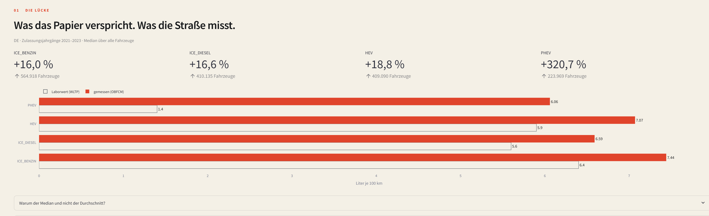
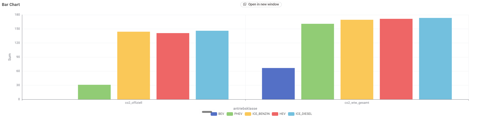
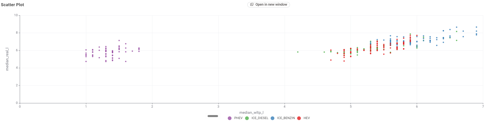
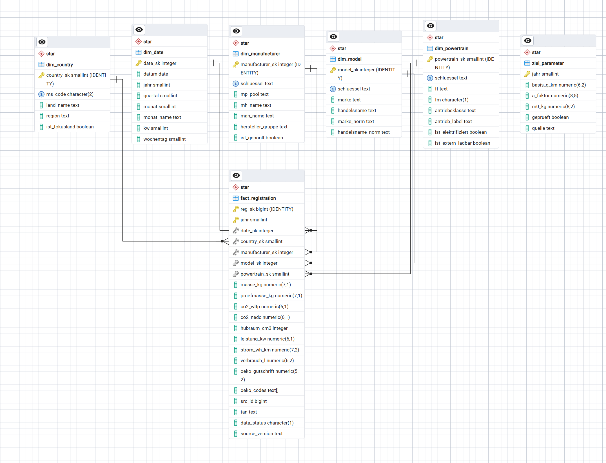

# Papier gegen Straße

**Wie weit liegen die zertifizierten CO₂- und Verbrauchswerte der EU-Neuwagenflotte
von den im Fahrbetrieb gemessenen entfernt?**

Seit 2021 schreibt jedes neue Auto in der EU seinen tatsächlichen Kraftstoff­verbrauch
mit einem Bordzähler mit und meldet ihn an die Kommission (VO (EU) 2019/631, Art. 12).
Dieselben Fahrzeuge stehen mit ihrem Laborwert in der Zulassungsdatenbank nach Art. 7.
Beide Bestände lassen sich über die Typgenehmigung verbinden — die Lücke ist damit
keine Schätzung, sondern eine Differenz am selben Fahrzeug.

Dieses Repository führt **45 Millionen amtliche Datensätze** aus drei Quellen in einer
PostgreSQL-Datenbank zusammen und wertet sie aus. Alles ist mit einem Aufruf
reproduzierbar.

---

## Ergebnisse

### Die Lücke, Deutschland, 1.608.112 Fahrzeuge



Median über alle Zulassungsjahrgänge, Kraftstoffverbrauch in l/100 km. Die Kontur ist
der Laborwert, die gefüllte Fläche der gemessene:

| Antrieb | Laborwert | gemessen | Abweichung | P90 |
|---|---:|---:|---:|---:|
| Benzin | 6,40 | 7,44 | **+16,0 %** | +34,8 % |
| Diesel | 5,60 | 6,59 | **+16,6 %** | +32,4 % |
| Hybrid ohne Stecker | 5,90 | 7,07 | **+18,8 %** | +37,4 % |
| Plug-in-Hybrid | 1,40 | 6,06 | **+320,7 %** | +666,5 % |

### Die Ursache ist eine Verhaltensannahme, keine Technik

Die WLTP-Regel unterstellt für Plug-in-Hybride rund **84 %** elektrische Fahrleistung.
Gemessen wurden in Deutschland **25,8 bis 27,0 %** — ein knappes Drittel. Über alle 27
Mitgliedstaaten reicht die Spanne von 23,5 % (Dänemark) bis 46,7 % (Zypern). Kein Land
kommt in die Nähe des unterstellten Werts.

Eine größere Batterie hilft dabei nicht, sondern schadet:

| E-Reichweite | Fahrzeuge | Lücke | elektrisch gefahren |
|---|---:|---:|---:|
| 45–60 km | 56.546 | +274,6 % | 26,8 % |
| über 60 km | 164.390 | **+316,6 %** | 29,5 % |

Der Extremfall ist ein Hersteller mit **110 km Reichweite und 17,4 % elektrischem
Fahranteil** — die größte Batterie im Feld, der schlechteste Ladeanteil. Eine größere
Batterie verbessert den Laborwert, nicht das Verhalten, und vergrößert damit die Lücke.

### Well-to-Wheel: der faire Vergleich

Auspuff plus Netzstrom, bewertet mit dem realen deutschen Strommix (355,6 g/kWh im
Fünfjahresmittel, fallend):

| Antrieb | offiziell | real | Abweichung |
|---|---:|---:|---:|
| Batterieauto | 0,0 | **66,7** | *nicht definiert* |
| Plug-in-Hybrid | 31,0 | **160,8** | +419 % |
| Benzin | 144,0 | **169,4** | +18 % |
| Hybrid | 141,0 | **171,4** | +22 % |
| Diesel | 146,0 | **173,3** | +19 % |



Alle Werte in g CO₂/km. Der Plug-in-Hybrid bleibt auf Flottenebene sparsamer als der
reine Benziner — die Kippgrenze liegt bei 500 g/kWh, der deutsche Mix bei 355,6 und
fallend. Sein zertifizierter Vorsprung schrumpft auf der Straße jedoch auf etwa ein
Zehntel.

Für das Batterieauto schreibt die Verordnung 0 g/km vor. Real sind es 66,7, über drei
Aufschlagsszenarien zwischen 58,0 und 75,4 — im ungünstigsten Fall noch 44 % des besten
Verbrenners.



*Laborwert (x) gegen gemessenen Verbrauch (y) je Modell. Die Plug-in-Hybride
liegen links unten als eigene Wolke — kleiner Laborwert, großer Realwert. Der
Abstand zur Winkelhalbierenden ist die Lücke.*

### Auf Modellebene kehrt sich die Rangfolge um

| | Laborwert | gemessen |
|---|---:|---:|
| BMW 116d (Diesel) | 4,60 l | 5,44 l |
| MG EHS Plug-in-Hybrid | 1,80 l | 8,58 l |

Der Diesel sollte laut Typprüfung 2,6-mal schlechter sein und verbraucht real 3,14 l
weniger. In **1.665 von 7.960 Modellpaaren (20,9 %)** dreht sich die Rangfolge auf der
Straße um.

### Hersteller: klein und sparsam heißt große Lücke

Nur reine Verbrenner, damit der Antriebsmix das Ergebnis nicht verzerrt:

| | Hersteller | Lücke | Masse | Leistung |
|---|---|---:|---:|---:|
| 1 | Mazda | +11,4 % | 1.555 kg | 135 kW |
| 2 | Porsche | +11,5 % | 1.870 kg | 294 kW |
| 3 | Volvo | +12,2 % | 1.625 kg | 120 kW |
| … | | | | |
| 22 | Dacia | +22,2 % | 1.181 kg | 67 kW |
| 23 | Renault | +22,5 % | 1.280 kg | 67 kW |
| 25 | BMW M | +24,5 % | 1.975 kg | 375 kW |

25 Hersteller, Spannweite 13,1 Prozentpunkte. Die plausibelste Erklärung ist der
Downsizing-Effekt: Ein kleiner aufgeladener Motor arbeitet im sanften Laborzyklus nahe
seinem Bestpunkt und verlässt diesen Bereich im Alltag sofort.

**Die Lücke ist eine relative Größe.** Renault verbraucht real 7,13 l, Porsche 12,31 l.
Der Renault bleibt das sparsamere Auto — er hält sein Versprechen nur schlechter ein.

Eine Rangliste über die *gesamte* Flotte wäre irreführend: Sie misst den Antriebsmix,
nicht die Motorentechnik. Die Korrelation zwischen Plug-in-Hybrid-Anteil und Verzerrung
beträgt **0,890**. Mazda liegt über die ganze Flotte bei 22,7 % und damit im Mittelfeld —
auf reine Verbrenner beschränkt bei 11,4 % und damit an der Spitze.

---

## Datenquellen

| Quelle | Inhalt | Zugang | Lizenz |
|---|---|---|---|
| EEA co2cars (Art. 7) | jede EU-Neuzulassung auf Fahrzeugebene | DiscoData SQL-REST | EEA Data Policy |
| EEA OBFCM (Art. 12) | Lebensdauer-Verbrauch je Fahrzeug | CSV-Direktdownload | CC-BY-4.0 |
| EEA OBFCM aggregiert | Lücke je Hersteller und Kraftstoff | CSV | CC-BY-4.0 |
| SMARD, Bundesnetzagentur | Stromerzeugung je Energieträger, stündlich | JSON-API | CC-BY-4.0 |

Für `co2cars` existiert kein CSV-Bulkdownload. Der SQL-REST-Endpunkt ist die einzige
Quelle für Rohdaten auf Fahrzeugebene: T-SQL im Query-String, JSON zurück, auf MS SQL
Server, ohne CTE-Unterstützung und mit begrenzter Antwortgröße.

---

## Architektur

```
                 EEA DiscoData          EEA OBFCM           SMARD
                 (SQL über HTTP)          (CSV)            (JSON)
                        │                   │                 │
                        └─────────┬─────────┴─────────────────┘
                                  ▼
   raw     alle Spalten TEXT, UNLOGGED — nichts wird geprüft, alles bleibt sichtbar
                                  │
                                  ▼
   core    typisiert und gefiltert · Antriebsklasse aus Ft × Fm · Lücke je Fahrzeug
                                  │
                                  ▼
   star    fact_registration, PARTITION BY RANGE (jahr) + 5 Dimensionen
                                  │
                                  ▼
   mart    eine Ergebnistabelle je Analyse — KNIME und Streamlit lesen nur hier
```



`meta` führt daneben das Ladeprotokoll und die Datenqualitätsbefunde.

**37.092.376 Zeilen** in der Faktentabelle. Zeilenkontrolle gegen `core`: Differenz null.

### Entscheidungen, die Laufzeit gekostet oder gespart haben

**Keyset-Paginierung statt OFFSET.** Bei rund 10 Mio. Zeilen je Jahrgang durchläuft der
Server für Seite *n* sonst alle vorherigen Zeilen erneut. Die Fensterweite justiert sich
aus der gemessenen ID-Dichte — sie schwankt zwischen 2,80 und 20,89 IDs je Zielzeile,
ein festes Fenster war für den Jahrgang 2021 um den Faktor 10 zu klein.

**`IS NOT DISTINCT FROM` ist nicht hashbar.** Die erste Fassung des Sternschemas verband
die Dimensionen damit, weil die Schlüsselspalten NULL enthalten können. Logisch korrekt,
praktisch unbrauchbar: PostgreSQL kann keinen Hash Join bilden und fällt auf Nested Loops
zurück. Mit einer verketteten Schlüsselspalte je Dimension (NULL → Leerstring) läuft der
Join über einfache Gleichheit.

| | vorher | nachher |
|---|---:|---:|
| Schreibrate | 15 MB/min | 1,3 GB/min |
| Laufzeit | über 6 h (hochgerechnet) | 10:06 |

**Indizes und Schlüssel erst nach dem Laden.** Während des Ladens hätte jede der 37 Mio.
Zeilen fünf Fremdschlüsselprüfungen ausgelöst.

**Fehlertolerante Typkonvertierung.** `core.zu_zahl()` gibt bei unbrauchbaren Werten NULL
zurück statt eine Ausnahme zu werfen — ein einziger kaputter Wert würde sonst einen
40-Minuten-Ladelauf abbrechen.

---

## Reproduzieren

Voraussetzungen: PostgreSQL 18, Python 3.11+, PowerShell 5.1+.

```powershell
# 1 · Python-Umgebung
.\03_skripte\00_setup_python_env.ps1

# 2 · Alles: Download, Laden, Auswertung
.\03_skripte\99_run_all.ps1

# oder ab einem bestimmten Schritt
.\03_skripte\99_run_all.ps1 -Ab 30_star
.\03_skripte\99_run_all.ps1 -Liste     # zeigt die Kette ohne sie auszuführen
```

Zwölf Schritte. Jeder schreibt seine Ausgabe nach `00_doku/<schritt>_ausgabe.txt`, die
Laufzeiten landen in `00_doku/_laufzeiten.csv`. Bricht ein Schritt ab, hält die Kette an
und nennt die fehlerhafte Datei.

**Der Download dauert mehrere Stunden und erzeugt rund 8,2 GB.** Die Rohdaten sind
deshalb nicht im Repository — sie sind vollständig aus den Skripten reproduzierbar.

---

## Was dieses Projekt über Datenqualität gelernt hat

17 Fehler sind protokolliert, **sechs davon stumm** — sie haben kein Programm abstürzen
lassen, sondern falsche oder leere Ergebnisse geliefert, während jeder Schritt „ok"
meldete. Die drei folgenreichsten:

**Ein Ladeschritt fehlte.** Downloader und Auswertung existierten, der Schritt dazwischen
nicht. Die Kette rechnete auf einer leeren Tabelle weiter und lieferte eine formal
vollständige Ergebnistabelle aus lauter Leerwerten. Alle vier Schritte meldeten Erfolg.
→ Ein leerer Eingang bricht jetzt ab, statt weiterzurechnen.

**`min()` auf Text wählt alphabetisch.** Der Kraftstoff-Emissionsfaktor wurde je
Antriebsklasse über `min(ft)` gezogen. In der PHEV-Klasse liefert das `diesel/electric` —
die gesamte Flotte wurde mit dem Dieselfaktor bepreist. Aufgefallen ist es nur, weil
dieselbe Flotte in zwei Ausgaben mit unterschiedlichen Werten erschien.
→ Zwei Zahlen für denselben Sachverhalt sind immer ein Fehler.

**Die Spaltenreihenfolge einer CSV wich von der Tabellendefinition ab.** Ein
positionelles `COPY` hätte Windstrom als Wasserkraft verbucht — unsichtbar, weil beide
den Emissionsfaktor 0 g/kWh tragen.
→ Die Spaltenliste wird aus der Kopfzeile gelesen, nicht angenommen.

**Annahmen stehen in Parametertabellen, nicht als Konstanten im SQL.** Jede trägt eine
Spalte `geprueft`. Die Prüfung hat zwei Werte korrigiert: Der angenommene
Emissionsfaktor für Benzin (2330 g/l) weicht von dem ab, mit dem die EEA selbst rechnet
(2278 g/l, aus ihren eigenen Daten über 94 Fahrzeuggruppen zurückgerechnet).

Vollständiges Protokoll: [`00_doku/07_Fehlerprotokoll.md`](00_doku/07_Fehlerprotokoll.md)

---

## Aufbau des Repositories

```
00_doku/              Ergebnisse, Qualitätsbefunde, Fehlerprotokoll, alle Ausgabedateien
  00_Projekt_verstehen.md      Einstieg ohne Fachbegriffe
  06_Ergebnis_...md            alle Befunde mit Herleitung
  07_Fehlerprotokoll.md        17 Fehler und was sie gelehrt haben
01_daten/             Rohdaten (nicht im Repository, reproduzierbar)
02_sql/               17 Dateien in Ausführungsreihenfolge
03_skripte/           Download, Laden, Orchestrierung
04_knime/             Workflow und Anleitung
05_visualisierung/    Diagramme und Datenbankmodelle
06_abgabe/            Bericht und Präsentation
```

---

## Grenzen

- **Der Realverbrauch von Batterieautos ist nicht gemessen.** Der Bordzähler erfasst
  Kraftstoff; ein Elektroauto hat keinen und steht nicht in dieser Quelle. Die BEV-Werte
  stammen aus der WLTP-Typprüfung und sind in der Ergebnistabelle als Laborwert
  gekennzeichnet. Der Vergleich ist an dieser Stelle nicht gleichwertig.
- **Keine Vorkette auf beiden Seiten.** Weder Raffinerie noch Kraftwerksbau sind
  enthalten. Für den Vergleich ist das konsistent, für eine absolute Klimabilanz nicht
  ausreichend.
- **Die Emissionsfaktoren der Kraftwerke sind Größenordnungen**, nicht gegen die
  UBA-Emissionsbilanz verifiziert. Sie liegen als Parametertabelle vor und lassen sich
  austauschen, ohne eine Abfrage anzufassen.
- **Biomasse ist bilanziell mit 0 g/kWh geführt.** Konsistent mit der Systemgrenze „nur
  Verbrennung am Ort", aber eine Wahl.

---

## Lizenz

Code: MIT. Die Daten unterliegen den Lizenzen ihrer Quellen (EEA Data Policy, CC-BY-4.0).
